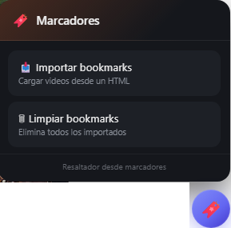

# YouTube & Niconico Bookmark Highlighter

**Última actualización:** 14 de julio de 2026

Resalta automáticamente los videos guardados en tus marcadores de Chrome tanto en **YouTube** como en **Niconico**. Incluye control de velocidad, amplificador de volumen hasta **300%** y un moderno menú flotante para administrar los bookmarks.

## 📖 Descripción

**YouTube & Niconico Bookmark Highlighter** es un UserScript para **Tampermonkey** que permite importar los marcadores exportados desde Google Chrome y resaltar automáticamente todos los videos que ya tienes guardados.

Además incorpora herramientas adicionales para mejorar la reproducción en YouTube, como un selector rápido de velocidad y un amplificador de volumen de hasta **300%**, todo integrado directamente en el reproductor.

El script funciona incluso con la navegación dinámica (SPA) de YouTube y mantiene el botón flotante siempre disponible.

---

# 📥 Instalación

1. Instala la extensión **Tampermonkey** en tu navegador.
2. Exporta tus marcadores de Chrome en formato **HTML** (opcional, para importar los videos).
3. Instala el script desde GitHub.

## ⚡ Instalar Script

1. Instala la extensión **Tampermonkey** para tu navegador.

2. Instala el script desde GitHub:

**➡️ [Instalar Script](https://github.com/wernser412/Resaltar-videos-youtube/raw/refs/heads/main/Resaltador%20desde%20marcadores%20(YouTube%20+%20Niconico).user.js)**

---

# ✨ Características

- 🔖 Resalta automáticamente videos guardados en tus marcadores.
- ▶️ Compatible con **YouTube**.
- 🎬 Compatible con **Niconico**.
- 📥 Importación de marcadores desde archivos HTML exportados por Chrome.
- 🗑 Eliminación de todos los marcadores importados.
- 🚀 Menú flotante moderno.
- 👁️ Posibilidad de mostrar u ocultar el botón flotante desde el menú de Tampermonkey.
- ⚡ Compatible con la navegación dinámica (SPA) de YouTube.
- 🔄 Conserva automáticamente los marcadores importados.
- 🎵 Amplificador de volumen de hasta **300%**.
- 💾 Guarda el volumen seleccionado entre sesiones.
- ⚡ Botón de cambio rápido de velocidad.
- ⏩ Velocidades disponibles:
  - 1×
  - 1.5×
  - 2×
- 🔄 Mantiene la velocidad al cambiar de video.
- 📺 Funciona correctamente incluso en pantalla completa.
- 🎨 Resalta tanto los videos de las listas como el título del video abierto.
- 🧠 Evita duplicados al importar marcadores.

---

# 🖥️ Uso

1. Exporta tus marcadores de Chrome en formato **HTML**.
2. Abre YouTube o Niconico.
3. Pulsa el botón flotante **🔖**.
4. Selecciona **Importar bookmarks**.
5. Elige el archivo HTML exportado.
6. Los videos guardados comenzarán a resaltarse automáticamente.

---

# 🎬 Funciones adicionales

## 🔊 Amplificador de volumen

En YouTube aparece un control adicional que permite aumentar el volumen hasta **300%**, superando el límite normal del reproductor.

El nivel elegido queda guardado automáticamente para futuras reproducciones.

---

## ⏩ Control de velocidad

Se añade un botón junto a los controles del reproductor para cambiar rápidamente entre:

- 1×
- 1.5×
- 2×

La velocidad permanece sincronizada al cambiar de video.

---

# 📁 Importación de marcadores

El script admite archivos **HTML** exportados directamente desde el administrador de marcadores de Google Chrome.

Durante la importación:

- Se detectan automáticamente enlaces de YouTube.
- Se detectan automáticamente enlaces de Niconico.
- Se eliminan duplicados.
- Los videos quedan disponibles inmediatamente para ser resaltados.

---

# 🌐 Sitios compatibles

Actualmente el script funciona en:

- YouTube
- Niconico

---

# 📄 Licencia

Este proyecto se distribuye bajo la licencia **MIT**.

Consulta el archivo **LICENSE** para más información.
